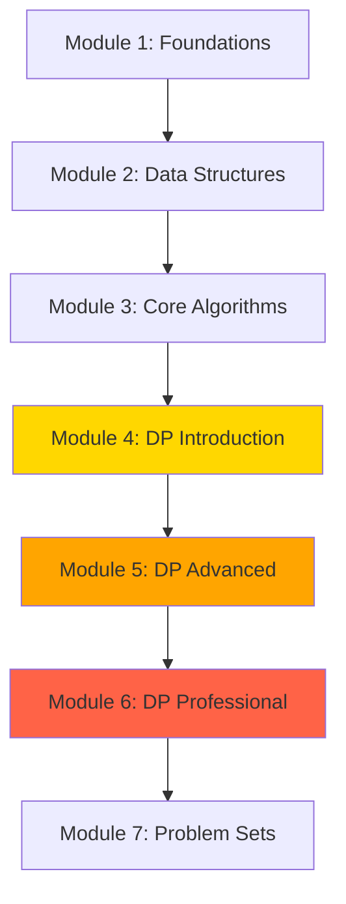

# 🚀 Data Structures & Algorithms in Python
## Focus: Dynamic Programming Mastery

Welcome to the most comprehensive DSA course with a **laser focus on Dynamic Programming**! This course takes you from fundamentals to professional-level problem solving.

## 📚 Course Overview

This course is designed to:
- Build strong foundations in Python programming and DSA fundamentals
- Master Dynamic Programming through progressive learning (60% of course content)
- Solve 150+ problems ranging from basic to professional level
- Apply DP to real-world applications and projects
- Prepare for technical interviews and competitive programming

## 🎯 Who Is This For?

- **Beginners**: Start from Module 1 and progress sequentially
- **Intermediate**: Jump to Module 3-4 if you know basic DSA
- **Advanced**: Focus on Modules 5-6 for advanced DP and real-world applications
- **Interview Prep**: Use Module 7 for company-specific problem sets

## 📖 Course Structure

### Module 1: Foundations (1 week)
Learn Python essentials, complexity analysis, and problem-solving patterns.
- 30 practice problems

### Module 2: Essential Data Structures (2 weeks)
Master arrays, linked lists, stacks, queues, hash tables, trees, and graphs.
- 100 practice problems

### Module 3: Core Algorithms (2 weeks)
Learn searching, sorting, recursion, backtracking, and two-pointer techniques.
- 60 practice problems

### Module 4: Dynamic Programming - Introduction (2 weeks) ⭐
Build strong DP foundations with memoization, tabulation, and basic patterns.
- 35 practice problems
- Real-world examples

### Module 5: Advanced Dynamic Programming (3 weeks) ⭐⭐
Master 2D DP, knapsack patterns, string DP, and bitmasking.
- 70 practice problems
- 3 real-world applications

### Module 6: Professional DP & Applications (3 weeks) ⭐⭐⭐
Learn tree DP, graph DP, interval DP, digit DP, and optimization techniques.
- 46 practice problems
- 5 complete real-world projects

### Module 7: Problem Sets & Mock Interviews
Curated problem sets organized by topic, company, and difficulty.
- 50+ additional problems
- 5 complete mock interview sets

## 🗓️ Study Roadmap

**Total Duration**: 13 weeks (3 months)

Refer to [ROADMAP.md](ROADMAP.md) for a detailed week-by-week study plan.

## 🎓 Learning Path



## 💡 How to Use This Course

1. **Sequential Learning**: Follow modules in order for complete mastery
2. **Practice First**: Try solving problems before viewing solutions
3. **Code Along**: Type out all examples - don't just read
4. **Spaced Repetition**: Revisit difficult problems after 1 week
5. **Build Projects**: Complete all real-world projects in Module 6

## 🛠️ Prerequisites

- Basic Python knowledge (variables, loops, functions)
- A computer with Python 3.8+ installed
- Jupyter Notebook or any Python IDE
- Enthusiasm to learn!

## 📂 Repository Structure

```
dsaJs/
├── README.md                          # You are here
├── ROADMAP.md                         # Week-by-week study plan
├── RESOURCES.md                       # Additional resources
├── Module_01_Foundations/             # Python basics & complexity
├── Module_02_Data_Structures/         # Arrays, lists, trees, graphs
├── Module_03_Core_Algorithms/         # Searching, sorting, recursion
├── Module_04_DP_Introduction/         # DP fundamentals ⭐
├── Module_05_DP_Advanced/             # Advanced DP patterns ⭐⭐
├── Module_06_DP_Professional/         # Pro DP & projects ⭐⭐⭐
└── Module_07_Problem_Sets/            # Practice problems
```

## 🏆 Problem Distribution

| Difficulty | Total | DP-Focused |
|------------|-------|------------|
| Easy       | 45    | 25         |
| Medium     | 75    | 50         |
| Hard       | 30    | 25         |
| **Total**  | **150+** | **100+** |

## 🎯 Learning Outcomes

After completing this course, you will:

✅ Understand time and space complexity deeply  
✅ Master all essential data structures  
✅ Recognize DP patterns instantly  
✅ Solve medium to hard DP problems confidently  
✅ Apply DP to real-world scenarios  
✅ Optimize DP solutions for space and time  
✅ Excel in technical interviews  

## 📌 Quick Start

```bash
# Clone the repository
git clone <your-repo-url>

# Navigate to the course
cd dsaJs

# Start with Module 1
cd Module_01_Foundations

# Open the first notebook
jupyter notebook 01_python_refresher.ipynb
```

## 🤝 Contributing

Found a bug or have a suggestion? Feel free to open an issue or submit a pull request!

## 📜 License

This course content is available for educational purposes.

---

**Ready to master Dynamic Programming?** Start with [Module 1: Foundations](Module_01_Foundations/README.md)!

**Questions?** Check out [RESOURCES.md](RESOURCES.md) for additional learning materials and community links.

Happy Coding! 💻✨
